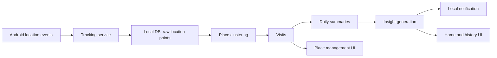

# Daily Pattern Insight App Design

## Overview

This project will turn the default Flutter app into an Android-first personal life-pattern insight app. The app records location changes in the background, groups raw coordinates into meaningful places, analyzes daily movement and visit patterns, and surfaces one or two concise insights each morning.

The product promise is:

> The user does not manually write a diary. The app quietly records enough context to explain yesterday.

## Source Idea

The design is based on the Notion page `기술 블로그 > 아이디어노트 > 일상 패턴 자동 분석 & 인사이트 앱`.

The core idea from that page is to focus on automatic interpretation rather than manual logging. The app should collect location-based behavior data, detect changes in daily patterns, and present the result as useful insight.

## MVP Scope

### Included

- Android-first implementation.
- Automatic background location collection on real Android devices.
- Battery-conscious movement-change and visit-focused tracking.
- Local-only storage for raw coordinates and derived summaries.
- Raw coordinates plus place summaries stored on device.
- Local place clustering to convert coordinates into meaningful place candidates.
- Manual place naming by the user.
- Rule-based insight generation for MVP.
- Interface boundary for future AI-based wording.
- Local morning notification at about 9:00 AM.
- Home screen with core insight cards and evidence timeline.
- Insight history by date.
- Place management screen.
- Settings for tracking, notification time, collection sensitivity, retention, and deletion.

### Deferred

- iOS background tracking.
- Login, server backend, cloud sync, or remote analytics.
- External reverse-geocoding or map/place APIs.
- Full map route visualization.
- Production AI API integration.
- Social, sharing, or coaching features.

## Product Principles

1. **Battery first.** The app should collect meaningful changes rather than constantly polling location.
2. **Private by default.** MVP data stays local. No server upload is required.
3. **Insight over logs.** The home screen should lead with interpretation, then show evidence.
4. **User control.** The user can pause tracking, rename places, tune sensitivity, and delete data.
5. **Expandable boundaries.** AI wording and native Android tracking can be added behind stable interfaces.

## Architecture

The Flutter app owns UI, local storage, analysis, settings, and insight presentation. Background tracking is placed behind a service boundary so the first implementation can use Flutter packages, while a future Android-native foreground service can replace the internals if plugin behavior is not reliable enough on physical devices.

### Modules

#### `tracking`

Responsible for:

- Requesting and checking location permissions.
- Starting and stopping background tracking.
- Applying collection sensitivity settings.
- Emitting normalized location events.
- Exposing current tracking status to the UI.

The public boundary should look like a service interface, not direct package calls spread through the app.

#### `storage`

Responsible for:

- Persisting raw location points.
- Persisting place clusters, visits, daily summaries, and insights.
- Applying retention rules.
- Supporting complete local data deletion.

The storage layer should be local-only in the MVP.

#### `place`

Responsible for:

- Grouping nearby points into place clusters.
- Detecting stay/visit windows.
- Updating cluster centers and visit counts.
- Supporting user-edited place names.

#### `analysis`

Responsible for:

- Building daily summaries from visits and movement data.
- Comparing yesterday with recent baseline data.
- Producing structured insight candidates.

#### `insights`

Responsible for:

- Ranking insight candidates.
- Turning structured analysis into user-facing sentences.
- Keeping an `InsightNarrator` boundary for later AI wording.

MVP implementation should use deterministic templates.

#### `notifications`

Responsible for:

- Scheduling the daily local insight notification.
- Opening the app to the relevant insight/history view.
- Rescheduling after settings changes or device reboot where supported.

The daily insight does not need alarm-clock-level precision. Android documentation recommends inexact alarms for most repeating work because exact alarms cost more battery and require special permission on modern Android versions.

#### `ui`

Responsible for:

- Home screen.
- Insight history screen.
- Place management screen.
- Settings screen.
- Permission and tracking status messaging.

## Data Flow



## Data Model

### `LocationPoint`

- `id`
- `timestamp`
- `latitude`
- `longitude`
- `accuracy`
- `speed`
- `isMock`
- `source`

### `PlaceCluster`

- `id`
- `centerLatitude`
- `centerLongitude`
- `radiusMeters`
- `displayName`
- `createdAt`
- `updatedAt`
- `visitCount`

### `Visit`

- `id`
- `placeClusterId`
- `startedAt`
- `endedAt`
- `durationMinutes`
- `representativeLatitude`
- `representativeLongitude`

### `DailySummary`

- `date`
- `totalDistanceMeters`
- `movingMinutes`
- `stationaryMinutes`
- `visitCount`
- `newPlaceCount`
- `longestStayPlaceId`

### `Insight`

- `id`
- `date`
- `type`
- `severity`
- `title`
- `body`
- `evidence`
- `createdAt`

## Tracking Strategy

The MVP should optimize for movement-change and visit-focused collection rather than dense route tracking.

Default behavior:

- Prefer distance-filtered updates over fixed short intervals.
- Use a foreground notification while tracking is active.
- Avoid high-frequency sampling as the default.
- Detect meaningful stay windows before creating visits.
- Store mock locations but mark them with `isMock` and exclude them from high-confidence insight evidence.

Initial default settings:

- Collection mode: battery saving.
- Minimum movement distance: 100 meters.
- Minimum stay duration: 10 minutes.
- Raw point retention: 30 days.
- Notification time: 9:00 AM.

The settings screen may expose these values for user adjustment.

## Place Clustering

MVP place detection should use local clustering.

Rules:

- If a stay window occurs near an existing cluster, attach the visit to that cluster.
- If it does not match an existing cluster, create a new unnamed place cluster.
- The user can rename a cluster, for example `Home`, `Office`, or `Gym`.
- Renamed clusters should keep their display name when the cluster center is updated.

External reverse-geocoding is out of scope for MVP.

## Analysis Rules

The MVP uses deterministic rules rather than machine learning.

### Movement Change

Compare yesterday's `totalDistanceMeters` and `movingMinutes` against the recent 7-day average. Generate an insight when the difference crosses a meaningful threshold.

Example:

> Yesterday's moving time was lower than your recent average.

### Visit Count Change

Compare yesterday's visit count against the recent 7-day average.

Example:

> Yesterday you visited fewer places than usual.

### New Place Detection

If yesterday created one or more new place clusters, generate an insight candidate.

Example:

> A new frequently visited place candidate was detected.

### Longest Stay

Identify the longest visit of the day and present it as evidence.

Example:

> Your longest stay yesterday was at `Home`.

### Confidence Filtering

Exclude low-accuracy or mock-only data from high-confidence insight evidence. If the available data is too weak, show a neutral message instead of overclaiming.

## Insight Generation

Insight generation has two layers:

1. Structured analysis creates `InsightCandidate` values.
2. A narrator turns candidates into text.

For MVP, the narrator is rule-based and deterministic. A future AI narrator can be added behind the same interface.

Example narrator boundary:

```dart
abstract interface class InsightNarrator {
  InsightText narrate(InsightCandidate candidate);
}
```

## Notifications

The app should schedule a local morning notification for the configured time, defaulting to about 9:00 AM.

The notification body should contain the strongest insight for the previous day. Tapping the notification opens the insight detail or history view.

Android exact alarms are intentionally not the default because they require special permissions on Android 12+ and are discouraged unless precise timing is core functionality. This app can tolerate slight delivery delay, so an inexact daily schedule is preferred for battery and permission simplicity.

## Screens

### Home

Primary content:

- Current tracking status.
- Permission or battery optimization warnings.
- Yesterday's top one or two insights.
- Evidence timeline for yesterday or today.

### History

Primary content:

- Date-grouped insights.
- Daily summary values.
- Empty state when there is not enough data.

### Place Management

Primary content:

- Detected places.
- Visit count and last visited date.
- Rename action.
- Optional merge/delete actions in a later iteration.

### Settings

Primary content:

- Tracking enabled.
- Notification enabled.
- Notification time.
- Minimum movement distance.
- Minimum stay duration.
- Raw point retention period.
- Delete raw points.
- Delete all local data.

## Permissions

The app must explain permissions before requesting them.

Android flow:

1. Explain why foreground location is needed.
2. Request foreground location permission.
3. When the user enables background tracking, explain why background location is needed.
4. Guide the user through background location access.
5. Request notification permission on Android versions that require it.
6. Show a persistent foreground notification while tracking is active.
7. Provide a clear setting to stop tracking.

## Privacy And Retention

MVP privacy stance:

- Data stays on device.
- No account is required.
- No server upload occurs.
- Raw coordinates are retained for 30 days by default.
- Visits, daily summaries, insights, and user-named places can remain longer.
- The user can delete raw points or all app data.

## Android Implementation Notes

The design should account for modern Android constraints:

- Background location access requires a separate permission path.
- Exact alarms require special permission on Android 12+ and are denied by default for many Android 14 fresh installs.
- Repeating exact alarms can increase battery cost.
- Foreground location service behavior must be visible to the user.

References:

- Android background location permissions: https://developer.android.com/develop/sensors-and-location/location/permissions/background
- Android alarm scheduling guidance: https://developer.android.com/develop/background-work/services/alarms/schedule
- `flutter_local_notifications` scheduling and Android permission notes: https://pub.dev/packages/flutter_local_notifications
- `flutter_background_geolocation` describes motion-aware battery-conscious tracking, but Android release builds require licensing: https://pub.dev/packages/flutter_background_geolocation

## Validation Criteria

The MVP is considered validated when it works on a real Android device.

Required checks:

- The app can request and explain required permissions.
- The user can enable background tracking.
- Location events are saved while the app is backgrounded.
- Movement/stay data creates at least one `Visit`.
- A `DailySummary` can be generated from stored visits.
- At least one rule-based `Insight` can be generated from a daily summary.
- The home screen shows the generated insight and evidence timeline.
- A local morning notification is scheduled and delivered around the configured time.
- The settings screen can stop tracking.
- Raw coordinate deletion works.
- Retention cleanup removes old raw points without deleting summaries or insights.

## Implementation Planning Defaults

These defaults should be used unless implementation research exposes a blocker.

- Local relational data: use Drift with SQLite, because the app needs structured queries, retention cleanup, and date-based summaries.
- Simple settings: use SharedPreferencesAsync or an equivalent lightweight preferences API for non-critical settings such as notification time and sensitivity.
- Permissions: use a dedicated permission service in Flutter, backed by Android manifest entries and runtime permission checks.
- Notifications: use `flutter_local_notifications` with an inexact daily schedule by default. Exact alarms should not be required for MVP.
- Background tracking: start behind a `LocationTrackingService` interface. Prefer a Flutter package only if it supports Android foreground-service location behavior reliably on real devices without unacceptable release constraints. If not, implement the tracking internals as an Android native foreground service using Fused Location Provider and expose it to Flutter through a platform channel.
- Diagnostics: include a developer-facing diagnostics view or section in settings for real-device validation. It should show permission state, tracking state, last stored point, last visit, last generated summary, and last scheduled notification.
- Initial thresholds: default to 100 meters minimum movement and 10 minutes minimum stay duration, then adjust after physical Android device testing.
