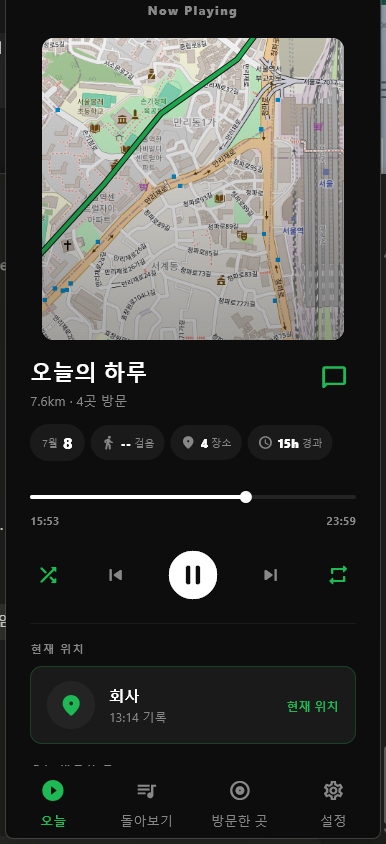
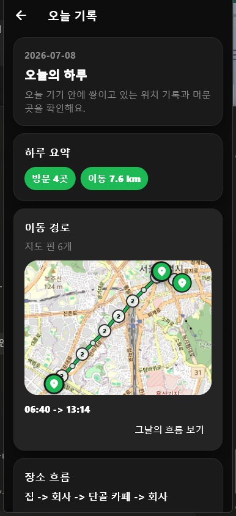
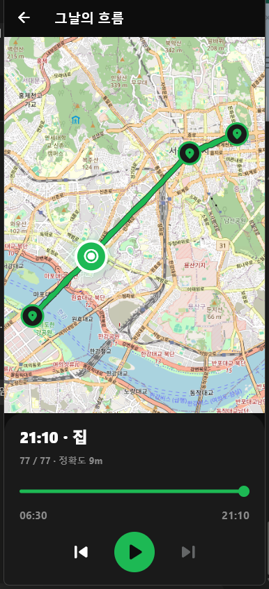
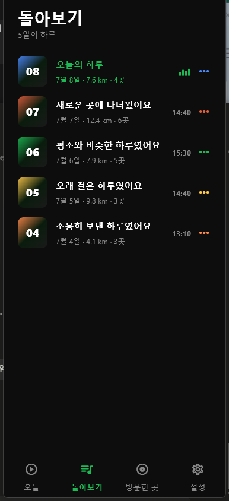
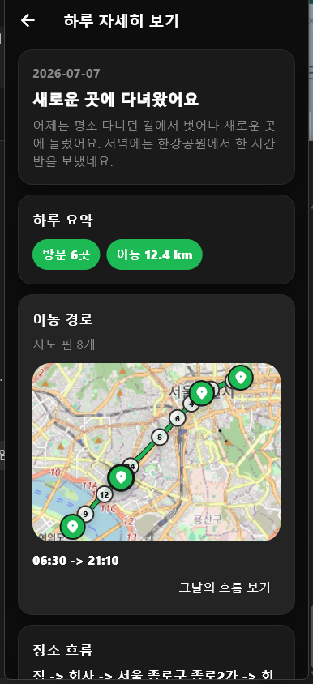
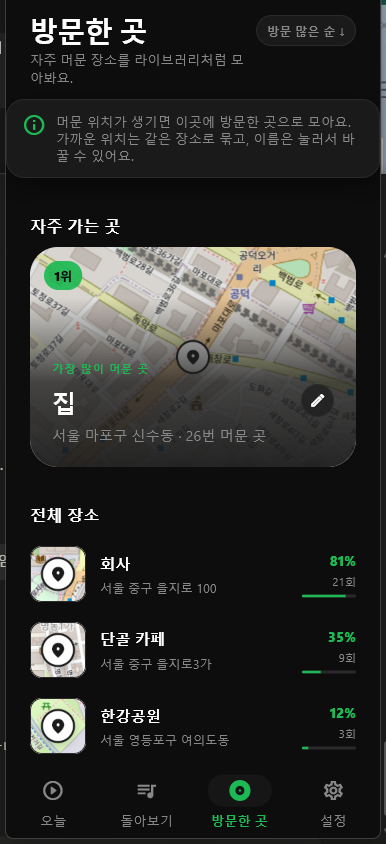
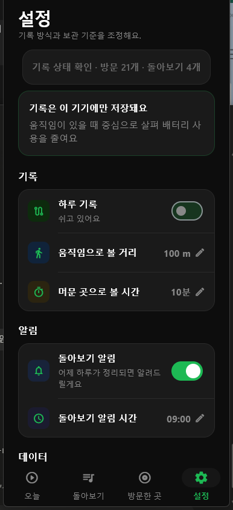

# 하루 기록

위치 기반 하루 기록 앱입니다. 사용자가 별도로 기록하지 않아도 기기 안에서 위치 흐름을 모으고, 하루 단위로 이동 경로와 머문 곳을 정리해 돌아볼 수 있게 만드는 Flutter 앱입니다.

현재 목표는 “내 하루를 자동으로 기록하고, 나중에 조용히 돌아볼 수 있는 앱”입니다. 지도 자체가 핵심인 앱이라기보다, 위치 데이터를 기반으로 하루의 흐름을 자연스럽게 보여주는 데 초점을 둡니다.

## 현재 구현된 기능

- 오늘 탭에서 오늘의 거리, 방문 수, 현재 기록 상태, 최근 돌아보기를 확인할 수 있습니다.
- 오늘 탭은 무거운 위치 계산이 끝나기 전에도 먼저 화면을 그리고, 데이터가 준비되는 순서대로 섹션을 갱신합니다.
- 오늘 기록 화면과 하루 상세 화면에서 이동 경로와 방문 기록을 확인할 수 있습니다.
- 흐름보기 화면에서 하루 동안 찍힌 위치를 시간 흐름에 따라 재생할 수 있습니다.
- 위치 경로는 원본 좌표를 그대로 보여주지 않고, 표시용 좌표를 후처리해 GPS 튐을 줄입니다.
- 머문 곳으로 판단된 지점을 사용자가 방문한 곳으로 저장할 수 있습니다.
- 방문한 곳 화면에서 저장된 장소의 이름, 방문 횟수, 지도 미리보기를 확인할 수 있습니다.
- 돌아보기 화면에서 생성된 하루 기록을 날짜별로 확인하고 상세 화면으로 이동할 수 있습니다.
- 설정 화면에서 위치 기록, 알림, 머문 곳 판단 기준, 이동 판단 기준, 데이터 삭제를 조정할 수 있습니다.
- Android 뒤로가기 종료 시 바로 종료하지 않고 확인 팝업을 띄웁니다.

## 주요 화면

| 오늘 | 오늘 기록 | 흐름보기 |
| --- | --- | --- |
|  |  |  |
| 현재 기록 중인 하루를 음악 플레이어처럼 보여주는 메인 화면입니다. | 오늘 쌓인 위치 기록, 이동 경로, 방문 기록을 자세히 봅니다. | 하루의 좌표 흐름을 재생바와 함께 시간순으로 봅니다. |

| 돌아보기 | 하루 상세 | 방문한 곳 |
| --- | --- | --- |
|  |  |  |
| 생성된 하루 기록을 날짜별로 모아봅니다. | 특정 날짜의 요약, 이동 경로, 방문 기록을 봅니다. | 사용자가 저장한 장소와 방문 횟수를 관리합니다. |

| 설정 |
| --- |
|  |
| 기록 기준, 권한, 알림, 데이터 관리를 조정합니다. |

스크린샷은 데모 데이터를 넣고 실행한 화면입니다. 같은 상태를 재현하려면 아래 명령을 사용합니다. 기존 로컬 기록이 지워지니 개발 장비에서만 사용하세요.

```bash
flutter run -t lib/dev/main_demo.dart
```

## 위치 기록 동작 기준

앱은 Android foreground service를 사용해 위치를 기록합니다. 기록된 좌표는 바로 “방문한 곳”이 되는 것이 아니라, 후처리 과정을 거쳐 이동 경로와 머문 곳 후보로 정리됩니다.

- mock 위치는 제외합니다.
- 정확도가 너무 낮은 좌표는 제외합니다.
- 같은 위치 근처에서 일정 시간 이상 머물면 머문 곳 후보로 판단합니다.
- 설정의 “움직임으로 볼 거리”는 같은 장소로 묶을 반경 기준에 영향을 줍니다.
- 설정의 “머문 곳으로 볼 시간”은 방문 후보가 되기 위한 최소 체류 시간에 영향을 줍니다.
- 방문한 곳에 자동 저장하지 않고, 사용자가 장소 흐름에서 직접 저장할 수 있게 했습니다.

## 데이터 처리 구조

- 원본 위치 좌표는 SQLite에 저장됩니다.
- 화면 표시용 이동 경로는 `LocationPostProcessor`를 거쳐 GPS 튐과 불필요한 점을 줄입니다.
- 하루 요약과 돌아보기는 위치 기록, 방문 기록, 최근 패턴을 기반으로 생성됩니다.
- 오늘 탭과 상세 페이지는 Riverpod provider를 나눠 사용해, 화면 전체가 하나의 Future에 막히지 않도록 구성했습니다.
- 지도는 `flutter_map`과 OpenStreetMap 타일을 사용합니다.

## 기술 스택

- Flutter / Dart
- Riverpod
- Drift + SQLite
- Android foreground service
- Workmanager
- flutter_local_notifications
- flutter_map + OpenStreetMap
- flutter_map_marker_cluster
- flutter_dotenv

## 환경 변수

루트에 `.env` 파일을 만들고 필요한 값을 설정합니다.

```env
KAKAO_REST_API_KEY=
```

현재 지도 표시는 OpenStreetMap 기반입니다. Kakao REST API 키는 좌표를 주소로 바꾸는 기능을 위해 남겨둔 설정입니다.

`.env.example`도 같은 형식으로 제공됩니다. `.env`는 Git에 포함하지 않습니다.

## 실행 방법

```bash
flutter pub get
flutter run
```

Android 실제 기기에서 위치 기록을 확인하려면 위치 권한, 백그라운드 위치 권한, 알림 권한이 필요합니다.

## 빌드 및 설치

```bash
flutter build apk --debug
adb install -r build/app/outputs/flutter-apk/app-debug.apk
adb shell monkey -p com.maoemong.harurecord -c android.intent.category.LAUNCHER 1
```

## 검증 명령

```bash
flutter analyze
flutter test
flutter build apk --debug
```

최근 작업에서 주로 확인한 테스트는 다음과 같습니다.

```bash
flutter test test/features/timeline/day_time_selection_test.dart
flutter test test/features/timeline/day_activity_preview_repository_test.dart
flutter test test/app/app_dependencies_test.dart
flutter test test/features/background/daily_insight_worker_test.dart
```

## 실제 기기 테스트 체크리스트

1. 앱 설치 후 설정에서 위치 기록을 켭니다.
2. 위치 권한, 백그라운드 위치 권한, 알림 권한을 허용합니다.
3. 설정에서 움직임 거리와 머문 곳 시간을 테스트 목적에 맞게 조정합니다.
4. 실제로 이동하거나 한 장소에 일정 시간 머뭅니다.
5. 오늘 탭에서 거리, 방문 수, 현재 위치 카드가 갱신되는지 확인합니다.
6. 오늘 기록 화면에서 이동 경로와 장소 흐름이 표시되는지 확인합니다.
7. 머문 곳 후보를 방문한 곳으로 저장하고 방문한 곳 화면에 반영되는지 확인합니다.
8. 하루가 지난 뒤 돌아보기와 하루 상세 데이터가 생성되는지 확인합니다.

## 현재 남은 과제

- 위치 좌표 후처리 정확도 개선
- 오늘 프리뷰 계산과 이동 경로 계산의 중복 제거
- 실제 장시간 백그라운드 위치 기록 안정성 검증
- 전체 화면의 깨진 한글 문구 정리
- 앱 아이콘, 릴리즈 서명 정보 확정
- 지도 제공 방식과 타일 정책 검토

## 개발 메모

- 앱 이름은 '하루 기록', 패키지 이름은 `haru_record`, 앱 ID는 `com.maoemong.harurecord`입니다.
- 지도는 보조 수단이고, 핵심은 “하루 흐름을 보기 좋게 정리하는 경험”입니다.
- 사용자가 직접 저장하지 않은 머문 곳은 방문한 곳으로 자동 등록하지 않는 방향입니다.
